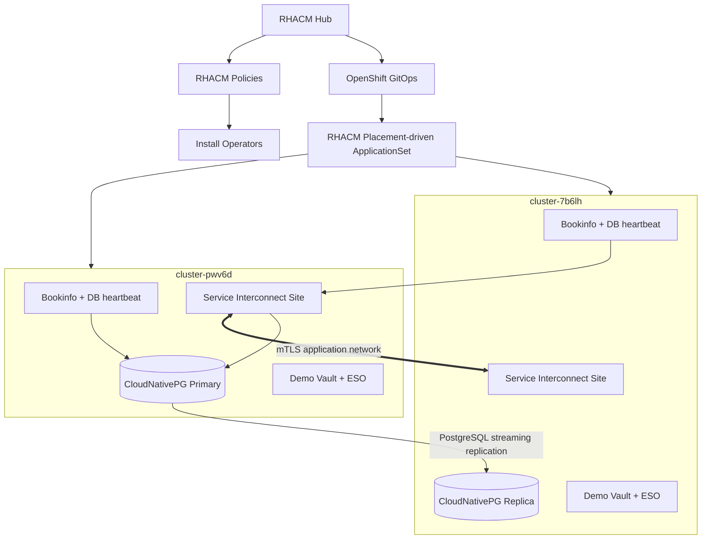

# RHACM Service Interconnect + PostgreSQL GitOps Demo

This repository deploys a two-site application demo controlled from an RHACM hub.

| Logical site | RHACM managed cluster |
|---|---|
| Site A | `cluster-pwv6d` |
| Site B | `cluster-7b6lh` |

The demo installs operators with RHACM policies, registers both managed clusters with OpenShift GitOps, and deploys all application resources through an RHACM Placement-driven Argo CD `ApplicationSet`.

## What is deployed

- Red Hat Service Interconnect 2.2 on both managed clusters
- External Secrets Operator for Red Hat OpenShift on both managed clusters
- Community CloudNativePG on both managed clusters
- Red Hat OpenShift GitOps on the RHACM hub
- A small demo Vault instance on each managed cluster
- PostgreSQL primary on `cluster-pwv6d`
- PostgreSQL streaming replica on `cluster-7b6lh`
- Bookinfo on both clusters
- A database heartbeat sidecar in each Bookinfo `productpage` pod

The same application configuration is used on both clusters:

```text
host=postgres-site-a,postgres-site-b
port=5432,5432
dbname=bookinfo
target_session_attrs=read-write
connect_timeout=5
```

The client tries both database sites and selects the writable PostgreSQL endpoint.

> This is a demonstration environment. The included Vault instances run in development mode and are not suitable for production.

## Architecture



## Prerequisites

Run the commands from a workstation logged into the RHACM hub as `cluster-admin`.

Required commands:

```text
oc
git
python3
openssl
```

The managed clusters must be available in RHACM:

```bash
oc get managedcluster cluster-pwv6d cluster-7b6lh
```

The repository must be pushed to a Git server reachable by the hub OpenShift GitOps instance. A public GitHub repository is the simplest option.

## Environment assumptions

The managed clusters must have:

- A working default `StorageClass`
- Outbound image-registry access
- Access to the Git repository from the hub OpenShift GitOps controller
- The Red Hat and community OperatorHub catalogs enabled

The manifests and scripts are validated locally, but they have not been executed against your live RHACM hub from this environment.

## Quick start

### 1. Create the GitHub repository

Extract the ZIP, enter the directory, and push it:

```bash
git init
git add .
git commit -m "Initial RHACM Service Interconnect demo"
git branch -M main
git remote add origin https://github.com/YOUR-ORG/rhacm-service-interconnect-postgres-demo.git
git push -u origin main
```

### 2. Run the bootstrap from the RHACM hub context

```bash
./bootstrap.sh \
  --repo-url https://github.com/YOUR-ORG/rhacm-service-interconnect-postgres-demo.git \
  --revision main
```

The bootstrap performs these steps:

1. Checks that the two RHACM managed clusters are available.
2. Adds placement labels to `cluster-pwv6d` and `cluster-7b6lh`.
3. Applies RHACM policies that install all required operators.
4. Waits for the operator CRDs on each cluster.
5. Registers both clusters with hub OpenShift GitOps using `GitOpsCluster`.
6. Creates the RHACM Placement-driven Argo CD `ApplicationSet`.
7. Generates temporary demo credentials outside Git.
8. Deploys and seeds each local demo Vault.
9. Copies the PostgreSQL replication certificates from Site A into Site B Vault.
10. Stores the Service Interconnect access token in Site B Vault.
11. Waits for Service Interconnect, PostgreSQL and Bookinfo to become ready.
12. Runs a replication test.

Generated credentials are written to:

```text
.work/demo.env
```

Protect this file. It is excluded by `.gitignore`.

## Local repository validation

```bash
./scripts/validate.sh
```

The first run creates `.work/validate-venv` and installs PyYAML inside that local
virtual environment. It does not modify the macOS system Python.

## Verify the deployment

```bash
./verify.sh
```

Run the database test:

```bash
./scripts/test-demo.sh
```

The test displays:

- Service Interconnect sites, links, connectors and listeners
- CloudNativePG primary and replica status
- Heartbeat rows written from both application clusters
- Bookinfo routes for Site A and Site B

You can also inspect the database heartbeat logs:

```bash
SITE_A_KUBECONFIG=.work/kubeconfigs/cluster-pwv6d.kubeconfig
SITE_B_KUBECONFIG=.work/kubeconfigs/cluster-7b6lh.kubeconfig

oc --kubeconfig "${SITE_A_KUBECONFIG}" \
  logs -n bookinfo deployment/productpage -c db-heartbeat --tail=50

oc --kubeconfig "${SITE_B_KUBECONFIG}" \
  logs -n bookinfo deployment/productpage -c db-heartbeat --tail=50
```

## RHACM and GitOps model

### Operator lifecycle

Operators are installed through enforced RHACM policies:

```text
install-openshift-gitops
install-service-interconnect
install-external-secrets
install-cloudnative-pg
```

### Application placement

The RHACM `Placement` selects exactly:

```text
cluster-pwv6d
cluster-7b6lh
```

The `GitOpsCluster` registers those clusters with the hub OpenShift GitOps instance. The `ApplicationSet` uses the RHACM placement decision and deploys:

```text
clusters/cluster-pwv6d
clusters/cluster-7b6lh
```

### Argo CD sync waves

| Wave | Resources |
|---:|---|
| `-50` | Namespaces |
| `-45` | Vault service account and SCC binding |
| `-40` | Demo Vault |
| `-30` | External Secrets store |
| `-25` | ExternalSecret resources |
| `-20` | Service Interconnect sites |
| `-15` | Site A AccessGrant |
| `-11` | Site B token bootstrap RBAC |
| `-10` | Site B AccessToken bootstrap job |
| `0` | Site A PostgreSQL primary |
| `5` | Site A connector and remote listener |
| `10` | Site B PostgreSQL replica |
| `12` | Site B connector and remote listener |
| `20` | Bookinfo |

## PostgreSQL replication

`cluster-pwv6d` hosts the writable CloudNativePG cluster:

```text
bookinfo-db
```

`cluster-7b6lh` hosts the standalone streaming replica:

```text
bookinfo-db-replica
```

The replica bootstraps through the Service Interconnect listener named `postgres-site-a`. CloudNativePG then maintains continuous PostgreSQL streaming replication.

This design is single-primary. It is not multi-primary or active-active PostgreSQL.

## External Secrets flow

No application passwords, PostgreSQL replication private keys, or Service Interconnect access codes are committed to Git.

The bootstrap script:

1. Generates the Bookinfo database password.
2. Stores it in each local demo Vault.
3. Exports Site A CloudNativePG replication certificates.
4. Stores those certificates in Site B Vault.
5. Reads the Site A Service Interconnect `AccessGrant`.
6. Stores the access token fields in Site B Vault.

External Secrets creates the Kubernetes Secrets required by CloudNativePG and the Service Interconnect link job.

The Vault authentication token is the unavoidable demo secret-zero. It is generated locally and applied directly to each cluster.

## Important configuration files

```text
hub/policies/                         RHACM operator policies
hub/gitops/                           Placement, GitOpsCluster and ApplicationSet
clusters/common/                      Shared Vault, ESO and Bookinfo resources
clusters/cluster-pwv6d/               Site A Service Interconnect and primary DB
clusters/cluster-7b6lh/               Site B link and replica DB
scripts/                              Bootstrap helpers and tests
```

## Troubleshooting


### ApplicationSet reports `ocm-placement-generator not found`

The `clusterDecisionResource` generator requires a ConfigMap in the same
namespace as the `ApplicationSet`. This repository creates
`openshift-gitops/ocm-placement-generator` and grants the ApplicationSet
controller permission to read RHACM `PlacementDecision` resources.

Verify it with:

```bash
oc get configmap ocm-placement-generator -n openshift-gitops -o yaml

oc auth can-i list placementdecisions.cluster.open-cluster-management.io \
  -n openshift-gitops \
  --as=system:serviceaccount:openshift-gitops:openshift-gitops-applicationset-controller

oc get placementdecision -n openshift-gitops
oc get applicationset,application -n openshift-gitops
```


### Repeated `JSONDecodeError` while waiting for operators

An older `wait_for_olm_subscription` implementation used both a here-string and
a here-document on the same `python3 -` command. Both compete for standard
input: Python received the program from the here-document, leaving no JSON for
`json.load()`.

The corrected helper no longer uses Python for this check. It reads the
Subscription and CSV fields directly with Kubernetes `jsonpath`.

When the Subscription already reports an installed CSV, the corrected output is
similar to:

```text
[OK] cluster-pwv6d: skupper-operator installed as skupper-operator.v2.2.1-rh-1
```


### Service Interconnect and CloudNativePG Subscriptions never resolve

The catalog values used by this environment are:

| Operator | Package | Catalog source | Channel |
|---|---|---|---|
| Service Interconnect | `skupper-operator` | `redhat-operators` | `stable-2` |
| External Secrets | `openshift-external-secrets-operator` | `redhat-operators` | `stable-v1.2` |
| CloudNativePG | `cloudnative-pg` | `certified-operators` | `stable-v1` |

A Subscription with no `status.currentCSV`, `status.installedCSV`, or InstallPlan
has not resolved.

Always use the full OLM resource name because the short name `subscription` can
resolve to the RHACM application Subscription API:

```bash
oc get subscriptions.operators.coreos.com -A
```

Do not install **Red Hat Service Interconnect Network Observer** for this demo.
It is a separate optional product. The required package is **Red Hat Service
Interconnect**, package name `skupper-operator`.


### `The extracted kubeconfig is not valid YAML`

Older repository versions used:

```bash
oc extract secret/NAME --keys=kubeconfig --to=-
```

Some `oc` versions emit an extraction header, which made the repository's
old first-line validation fail even when the Hive Secret was correct.

The corrected script reads the Secret as JSON and base64-decodes either:

```text
data.kubeconfig
data.raw-kubeconfig
```

It then validates the file with:

```bash
oc --kubeconfig FILE config view --raw
oc --kubeconfig FILE whoami
```

Remove any failed temporary files before retrying:

```bash
rm -f .work/kubeconfigs/*.kubeconfig
rm -f .work/kubeconfigs/*.tmp
rm -rf .work/bootstrap.lock
```


### Bootstrap stops at `Retrieving Hive admin kubeconfigs`

First make sure only one bootstrap process is running:

```bash
pgrep -fl 'bootstrap.sh'
```

Stop older copies before starting another run.

Hive does not guarantee that the admin kubeconfig Secret has a fixed name. The
bootstrap reads the authoritative Secret reference from:

```text
ClusterDeployment.spec.clusterMetadata.adminKubeconfigSecretRef.name
```

Inspect it manually:

```bash
for cluster in cluster-pwv6d cluster-7b6lh
do
  echo "=== ${cluster} ==="
  oc -n "${cluster}" get clusterdeployment "${cluster}" \
    -o jsonpath='{.spec.clusterMetadata.adminKubeconfigSecretRef.name}{"\n"}'
done
```

Remove old cached files if they contain log output or are not usable
kubeconfigs:

```bash
rm -f .work/kubeconfigs/*.kubeconfig
```

The corrected bootstrap validates each cached kubeconfig before reusing it and
prevents two bootstrap processes from running concurrently.


### Placements show `No status`

A `Placement` can only select clusters from a `ManagedClusterSet` that is bound
to the Placement namespace. This repository binds the RHACM `global` cluster
set to both:

```text
si-demo-policies
openshift-gitops
```

Check the bindings and decisions:

```bash
oc get managedclustersetbinding -A
oc get placementdecision -n si-demo-policies
oc get placementdecision -n openshift-gitops
```

Expected policy decisions include `local-cluster`, `cluster-pwv6d`, and
`cluster-7b6lh`.


Check RHACM policies:

```bash
oc get policy -n si-demo-policies
```

Check GitOps:

```bash
oc get gitopscluster,placement -n openshift-gitops
oc get applicationset,application -n openshift-gitops
```

Check Site A:

```bash
oc --kubeconfig .work/kubeconfigs/cluster-pwv6d.kubeconfig \
  get site,accessgrant,connector,listener -n bookinfo

oc --kubeconfig .work/kubeconfigs/cluster-pwv6d.kubeconfig \
  get cluster.postgresql.cnpg.io -n bookinfo
```

Check Site B:

```bash
oc --kubeconfig .work/kubeconfigs/cluster-7b6lh.kubeconfig \
  get site,accesstoken,link,connector,listener -n bookinfo

oc --kubeconfig .work/kubeconfigs/cluster-7b6lh.kubeconfig \
  get cluster.postgresql.cnpg.io -n bookinfo
```

Check External Secrets:

```bash
oc --kubeconfig .work/kubeconfigs/cluster-7b6lh.kubeconfig \
  get clustersecretstore,externalsecret -A
```

More detail is available in [docs/troubleshooting.md](docs/troubleshooting.md).

## Cleanup

Remove the demo applications and RHACM GitOps resources while leaving operators installed:

```bash
./cleanup.sh
```

Also remove the operator policies and subscriptions:

```bash
./cleanup.sh --remove-operators
```

The cleanup does not delete either OpenShift cluster.

## Production considerations

Replace the included development Vault with an enterprise secrets manager such as:

- HashiCorp Vault
- AWS Secrets Manager
- Azure Key Vault
- Google Secret Manager
- IBM Cloud Secrets Manager

For production PostgreSQL DR, add:

- Object-store backups and WAL archiving
- Defined RPO and RTO targets
- Tested promotion and fencing procedures
- Monitoring and alerting
- Storage and failure-domain planning
- Network latency and bandwidth testing
